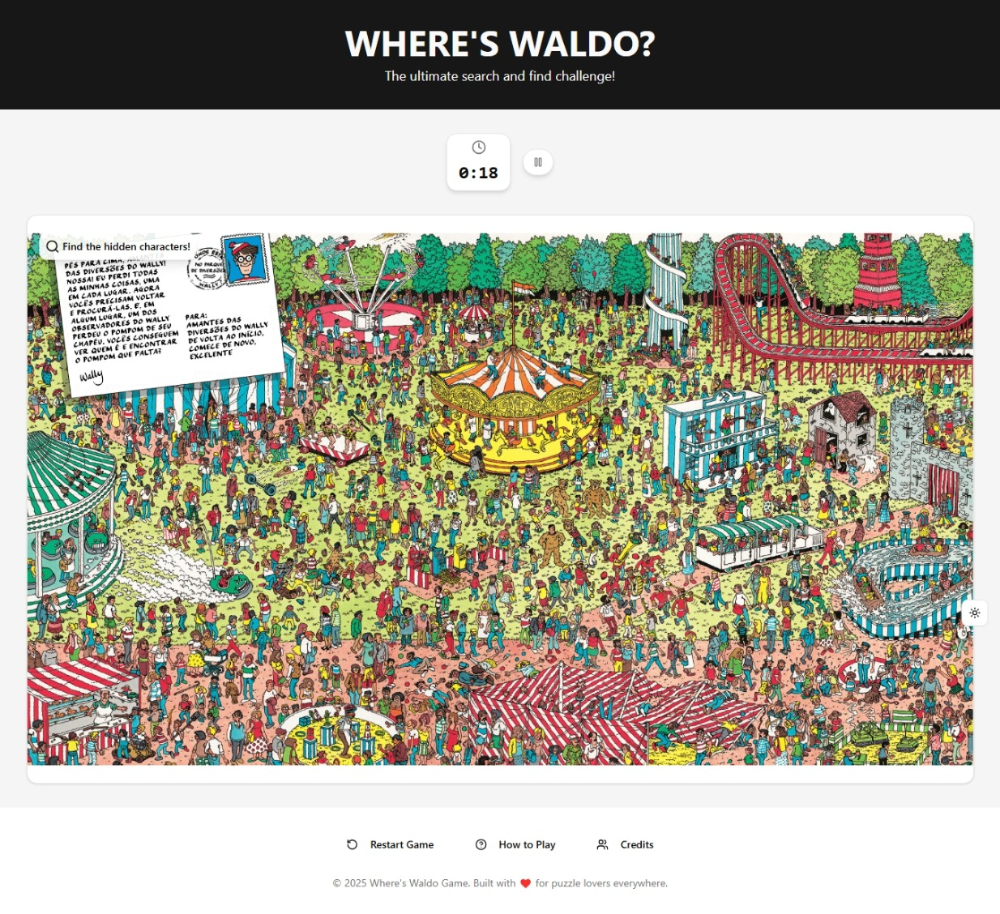

# 🕵️‍♂️ Where’s Waldo? (Photo Tagging Game)

A fun, interactive photo-tagging web app featuring a modern React/TypeScript frontend and a Node.js/Prisma API backend. Inspired by the classic Where’s Waldo? books, this app lets players hunt for hidden characters in detailed scenes and submit their fastest times to a global leaderboard.

---

## 🚀 Live Demo

- <https://whereiswaldoonline.netlify.app/>

## Screenshots





---

## 📁 Project Structure

```
blog-project/
│
├── backend/                # Node.js + Express + Prisma ORM
│
├── frontend/               # React + Vite
```

---

## 🛠 Tech Stack

- **Frontend**: React, TypeScript, Vite, Tailwind CSS, ShadCN UI, Motion, Lodash, ZOD
- **Backend**: Node.js, Express, TypeScript, Prisma ORM, PostgreSQL, ZOD
- **Dev Tools**: Monorepo with npm workspaces, ESLint, Prettier, dotenv

---

## ✨ Features

### 🧠 Backend

- **Robust Node.js API with TypeScript**  
  Scalable and type-safe backend built using Express and TypeScript for improved maintainability.

- **PostgreSQL with Prisma ORM**  
  Modern, developer-friendly database access with auto-generated types and schema migrations.

- **RESTful Endpoints for Game Logic**  
  Clean and well-structured API handles game scenes, character locations, and result submissions efficiently.

---

### 🎨 Frontend

- **Fast & Modern Stack: React + TypeScript + Vite**  
  Blazing fast development with strong typing and modular architecture.

- **Interactive UI with Motion**  
  Smooth animations enhance the experience of clicking, selecting, and completing levels.

- **Responsive Design with Tailwind CSS**  
  Works beautifully across desktop and mobile with utility-first styling.

- **Dark/Light Mode Toggle**  
  Accessible and user-friendly theme switching for comfort in any lighting.

## Getting Started

### Prerequisites

- Node.js (18+ recommended)
- npm or yarn
- PostgreSQL (or SQLite for development)

### 1. Clone the repository

```bash
git clone https://github.com/your-username/where-is-waldo.git
cd where-is-waldo
```

### 2. Setup the Backend

```bash
cd backend
cp .env.example .env
# Edit .env with your database credentials
npm install
npx prisma migrate dev
npm run dev
```

### 3. Setup the Frontend

```bash
cd ..
cd frontend
cp .env.example .env
npm install
npm run dev
```

## Development Notes

- **Code Quality**: ESLint and Prettier are set up to enforce consistent formatting and catch common bugs during development.
- **Environment Configuration**: Be sure to define required environment variables. For example, `ALLOWED_ORIGIN` must be set to enable proper CORS handling for backend requests.

---

## 📄 License

This project is licensed under the [MIT License](https://opensource.org/licenses/MIT).

You're free to use, modify, and distribute this code — **but please credit the original author by linking back to this repository**.

---

## Credits

- Built by [David P.](https://www.linkedin.com/in/davidp919)
